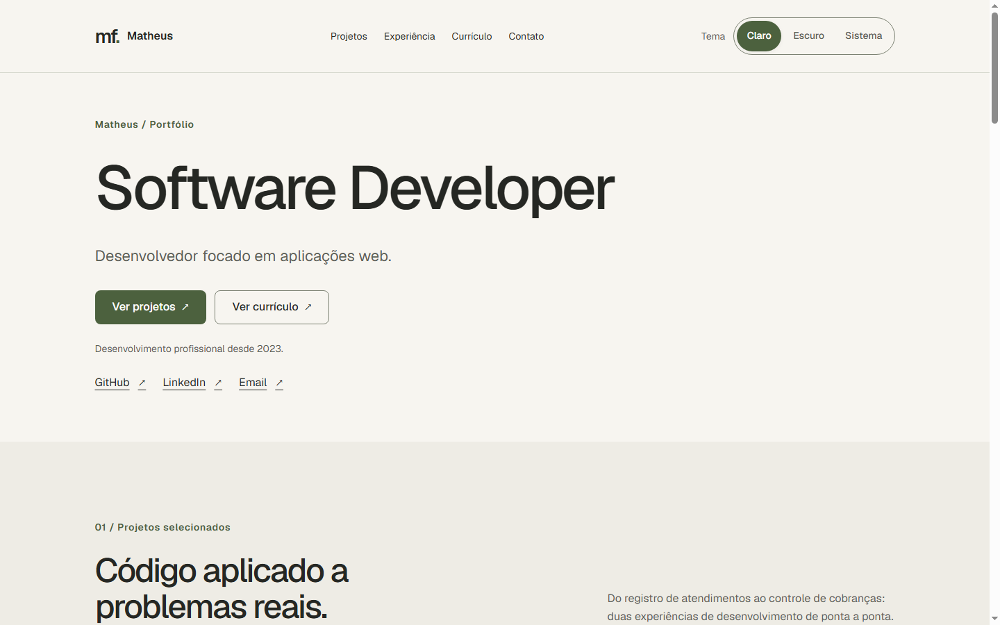
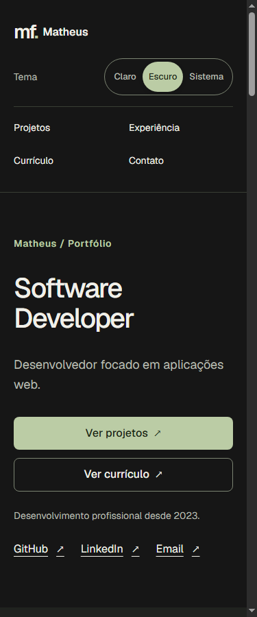

# Matheus Felix — Portfólio

Portfólio profissional com projetos reais, experiência, currículo e contato.
Uma aplicação Next.js com conteúdo local tipado, Server Components e temas
claro, escuro e sistema.



<details>
<summary>Visualização mobile em tema escuro</summary>



</details>

Capturas reais do build de produção local em 1440 × 900 e 375 × 900px.
**Site publicado:** [matheus-felix-portfolio.vercel.app](https://matheus-felix-portfolio.vercel.app).
Hospedado na Vercel, no workspace MatheusDev (Hobby), com deploy pela branch
`main` após merge de PR revisado. Consulte o [fluxo obrigatório em plans.md](plans.md)
e o [guia de publicação](docs/deployment.md).

## Estado do projeto

- Milestones 1 a 5 implementados: base, design system, Home, cases, currículo e contato.
- Milestone 6: SEO, layout, teclado, temas e medição de performance em laboratório revisados; limites da validação descritos abaixo.
- Milestone 7: README, screenshots, CI no GitHub e deploy na Vercel concluídos; site público validado.
- Milestone 8: fluxo por issues/PRs, motion com SplitText e ScrollTrigger, e teste de sitemap; refinamentos e relatório acompanhados nas issues #5/#6 e no PR #4.
- Perfil em `src/data/profile.ts`, com os contatos fornecidos por Matheus.
- Experiências em andamento usam `endDate: null` ou omitem a propriedade.
- PDF e detalhes ainda não confirmados dos cases permanecem como TODOs nos arquivos de manutenção, sem aparecer como anotações no site.

O [plans.md](plans.md) define o escopo e a arquitetura. Informações posteriormente
atualizadas por Matheus nos dados devem ser preservadas. As orientações de
manutenção estão em [AGENTS.md](AGENTS.md).

## Fluxo de trabalho

Toda correção, melhoria, funcionalidade ou documentação começa com uma issue.
Trabalhe em branch, valide e abra PR para `main`, mencionando as issues na descrição
com `Closes #N` ou `Refs #N`. O template do repositório orienta escopo e validações.
Não faça push direto na `main`. CI e preview devem ser conferidos antes da revisão
e do merge autorizado, que aciona produção. Abrir um PR não autoriza publicar.
As regras completas ficam na seção 0.1 de [plans.md](plans.md).

## Executar localmente

Requisitos: Node.js 22.x, a partir de 22.13, e npm. CI e Vercel usam Node.js 22.

```sh
npm ci
npm run dev
```

Acesse http://localhost:3000. O desenvolvimento funciona sem variáveis de ambiente.
A fonte Geist usa `next/font/google`: o build precisa acessar o Google Fonts;
as fontes são servidas pela aplicação ao visitante.

Para testar o build de produção:

```sh
npm run build
npm start
```

Em outro terminal, execute `npm run audit:site`. Para outra porta:

```sh
node scripts/audit-site.mjs http://localhost:3100
```

## Scripts e CI

| Comando | Função |
| --- | --- |
| `npm run dev` | Desenvolvimento com atualização automática |
| `npm run lint` | ESLint sem tolerar avisos |
| `npm run typecheck` | Tipos de rotas e TypeScript strict |
| `npm test` | Testes de tema, SEO e experiências em andamento |
| `npm run build` | Build de produção |
| `npm start` | Servidor de produção após o build |
| `npm run audit:site` | Auditoria HTTP local; aceita origem HTTPS com `--remote` |

O [workflow de CI](.github/workflows/ci.yml) executa `npm ci`, lint, typecheck,
testes, build e auditoria HTTP. É acionado em pushes na `main`, pull requests
para `main` e manualmente pelo GitHub Actions. Usa cache do npm, permissão
somente de leitura e encerra o servidor temporário após a auditoria.
Não requer secrets nem realiza deploy. A integração da Vercel publica a `main`
separadamente. Consulte as [execuções do CI](https://github.com/Matheus1221/MatheusFelixDev/actions/workflows/ci.yml).

## Stack e arquitetura

Next.js 16, React 19, TypeScript strict, CSS e Geist. O App Router organiza as
rotas. Server Components mantêm o conteúdo no servidor. `ThemeToggle` cuida das
preferências e armazenamento local; `HeroMotion` e `ScrollReveal` isolam motion com
GSAP e `@gsap/react`, recebendo o conteúdo renderizado no servidor como children.

```text
Navegador → Next.js App Router
             ├── Páginas e layouts no servidor
             ├── Conteúdo TypeScript local
             ├── ThemeToggle no cliente
             ├── HeroMotion no cliente, somente na Home
             ├── ScrollReveal local em projetos e blocos selecionados
             └── Metadata, sitemap, robots e imagem social
```

O conteúdo é pequeno e versionado junto ao código: não há necessidade de banco
ou CMS. O MVP não tem regras de negócio que justifiquem backend separado,
API própria ou Server Actions. CSS com tokens atende ao design sem biblioteca visual.

O Hero anima as linhas do título com SplitText e coordena a descrição em uma
Timeline de até 0,65s (0,39s no mobile). O título se desloca até 20px/8px e
permanece opaco e visível; botões e links não esperam a entrada terminar.
autoSplit/onSplit acompanham mudanças de fonte/largura e revert restaura o HTML.

A ampliação inclui entrada de cada projeto e detalhe nas capas, bloco Sobre,
empregos da Home, categorias da stack, CTA final e página de contato. ScrollTrigger
dispara as entradas uma vez em `top 85%`, sem pin, scrub ou interferência no scroll.
São nove triggers na Home com os dados atuais e um em contato. Os blocos usam até
24px e 0,78s no desktop; mobile usa até 10px e 0,4s, com a stack como bloco único.
As marcas decorativas das capas usam máscaras por linha (100%/30% de deslocamento
na própria máscara), em até 0,71s/0,4s. O título acessível de cada projeto fica visível.
Não há estilos que ocultem conteúdo enquanto aguarda a viewport.

`useGSAP` e `gsap.matchMedia` cuidam de scope e cleanup; movimento reduzido e
impressão desativam os efeitos. Hover e foco continuam em CSS. Currículo, textos
dos cases, header e footer ficam estáticos. A análise está na seção 24.1 de
[plans.md](plans.md).

Validação da ampliação em 27/09/2026: lint, typecheck, 13 testes, build e auditoria
HTTP aprovados. No Chrome, a Home foi conferida em 375px e 1440px com motion normal,
reduzido, JavaScript desativado e scripts bloqueados: conteúdo visível e sem overflow.
Também passaram rolagem rápida, entradas sem repetição, details, âncoras, teclado,
troca de preferência/tema/breakpoint, impressão e interrupção por navegação com
reversão dos estilos. Três ciclos Home/contato não apresentaram erros de execução.
Home e currículo foram conferidos adicionalmente em 320, 768, 1024 e 1920px com
movimento reduzido; a timeline do currículo permanece estática.
Essa conferência pontual não constitui uma suíte permanente de testes de navegador.

SplitText também foi conferido em 320, 375, 768, 1024, 1440 e 1920px: linhas em
blocos transformáveis, proporções preservadas e HTML restaurado após a entrada.
Passaram fonte atrasada, resize, movimento reduzido e desmontagem durante o Hero.
O [relatório de animações](docs/animations.md) detalha os efeitos, parâmetros,
referências oficiais, arquitetura, manutenção e limites das verificações.

```text
.github/workflows/  Validação no GitHub Actions
docs/              Publicação e screenshots do portfólio
src/app/           Rotas, layout, CSS, SEO e imagem social
src/components/    Layout, UI, projetos e timeline
src/data/          Perfil e contatos
src/content/       Experiências, stack e projetos
src/lib/           Tema, projetos, origem pública e metadata
src/types/         Contratos do conteúdo
scripts/           Auditoria HTTP
tests/             Regressões de tema, SEO e timeline
```

As dependências de desenvolvimento são ESLint, configuração Next.js, TypeScript
e definições de tipos. ESLint 9 permanece por compatibilidade com os plugins
instalados; revisar essa restrição antes de atualizar a versão principal.

## Rotas e manutenção dos dados

| Rota | Conteúdo |
| --- | --- |
| `/` | Apresentação, projetos, sobre, experiência, stack e contato |
| `/projetos/get-doc` | Case proprietário e escala confirmada |
| `/projetos/deixa-na-conta` | Gestão financeira e caso técnico de configurações da conta |
| `/curriculo` | Currículo HTML e PDF quando disponível |
| `/contato` | Canais profissionais confirmados |

Edite `src/data/profile.ts` para nome, cargo, resumo, formação e contatos.
Home, currículo, cabeçalho, rodapé, metadata e imagem social reutilizam o perfil.
Email, GitHub, LinkedIn, localização e disponibilidade são opcionais; campos
ausentes não geram links fictícios. Não há formulário ou serviço de envio no MVP.

As experiências ficam em `src/content/experience.ts`. Use datas `YYYY-MM`:
uma data em `endDate` representa um vínculo encerrado; `null` ou propriedade
omitida representa vínculo atual. A interface mostra “Atual” como texto comum,
mantendo `<time dateTime>` apenas nas datas reais. Home e currículo compartilham
a timeline. A lista usa `readonly Experience[]`, inclusive quando todos os
vínculos não têm data de término.

A formação técnica é opcional, em `profile.technicalEducation`. O início do
curso em 2019 foi confirmado por Matheus e aparece na Home e no currículo,
sem presumir conclusão. `professionalSince` é independente da formação:
permanece em 2023 conforme o perfil editado, embora a timeline comece em 2022;
essa diferença ainda precisa de confirmação.

O download do currículo só aparece quando `public/documents/cv.pdf` existe
no build. Adicione o PDF final nesse caminho e gere outro build para habilitá-lo.
Os projetos em `src/content/projects.ts` compartilham um template;
slugs desconhecidos retornam 404.

Seções opcionais dos cases e seus links de navegação só aparecem quando há
conteúdo: status, arquitetura, tecnologias, imagens e links públicos. Arrays
de parágrafos vazios também não geram seções. Em `technicalCase`, preencha
`investigation`, `correction` e `result` apenas quando houver informações
confirmadas; cada etapa pode ser omitida. Mantenha TODOs em comentários do
código, não nos textos exibidos. A auditoria HTTP rejeita `TODO:` no HTML público.

GET DOC mantém o aviso de código proprietário. A stack do Deixa na Conta foi
confirmada nas anotações fornecidas por Matheus: Next.js, React, TypeScript,
PostgreSQL, Auth0 e libphonenumber-js. O relato de UPDATEs no MySQL foi retirado,
assim como a atribuição de atuação da modelagem ao deploy. O case distingue
funcionalidades do produto, contribuições individuais e entregas colaborativas,
com foco técnico na evolução das configurações da conta, sem métricas de performance.

`contributions` contém blocos de título e descrição para a atuação. `architecture`
aceita texto ou blocos; `technicalCase` contém título e as etapas do relato técnico.
`repositoryPrivate: true` oculta links de repositório e identifica o código privado,
preservando a possibilidade de exibir uma aplicação pública autorizada.
A stack geral do perfil não deve ser atribuída
automaticamente aos projetos. Imagens só devem ser incluídas com divulgação
autorizada, dimensões e legendas; as capas atuais são tipográficas.

## SEO e configuração

Copie `.env.example` para `.env.local` e configure `SITE_URL` com a origem HTTPS
definitiva, sem caminho, query, fragmento ou credenciais. No deploy, configure
essa variável antes do build. Não publique `.env.local`.

Sem `SITE_URL`, o site usa `noindex`, robots com `Disallow: /` e sitemap vazio.
Com uma origem válida em produção, as cinco páginas ganham URLs canônicas,
imagem de compartilhamento e entradas no sitemap. Desenvolvimento e previews
da Vercel permanecem não indexáveis. Alterar a URL exige um novo build.
Valor inválido interrompe o build. O favicon é `/icon.svg`; `/og` gera o PNG social.

## Validações e limites

Lint, typecheck, 13 testes, build e auditoria HTTP passaram localmente após as
alterações de perfil, formação e cases. O HTML da Home e do currículo foi conferido
com o curso iniciado em 2019, o vínculo atual e somente datas reais em `time`.
O [primeiro CI remoto](https://github.com/Matheus1221/MatheusFelixDev/actions/runs/35479899825)
passou no commit `2a6e057`, incluindo instalação limpa e auditoria HTTP em Linux.

O layout foi medido no Chrome em 320, 375, 425, 768, 1024, 1440 e 1920px:
cinco páginas × sete larguras × dois temas, sem transbordamento horizontal.
Capturas desktop/mobile foram inspecionadas. Há foco visível, link para pular ao
conteúdo, controles nativos com altura mínima de 44px e movimento reduzido.
Contrastes calculados dos textos verificados são ≥ 4,5:1.

A auditoria HTTP verifica páginas, links internos, âncoras, títulos, semântica
básica, 404, recursos SEO e CSS compilado. Rejeita BOM no CSS para prevenir a
regressão que desativava os tokens de layout; `.editorconfig` define UTF-8 sem BOM.
Os testes cobrem temas, SEO e renderização de experiências atuais e encerradas.

A navegação por Tab foi verificada no Chrome em cinco páginas, a 320 e 1440px,
incluindo ordem, foco visível, nomes acessíveis, link de pular conteúdo e
controles nativos. Os três temas foram acionados pelo teclado, com persistência
entre páginas, resposta ao tema do sistema e movimento reduzido.

Na medição local de 19/09/2026, após a revisão final, o Lighthouse 12.8.2 registrou
98 em performance e 100 em acessibilidade, boas práticas e SEO, com LCP de 2,23s,
CLS 0 e TBT de 106ms. Esses resultados são de laboratório, não dados de visitantes.
Não foi medido INP. Refluxo foi testado por emulação de viewport equivalente a
200% e 400%; isso não substitui zoom real ou avaliação humana com leitor de tela.
O tema salvo foi conferido no DOMContentLoaded, sem uma análise visual quadro a
quadro do primeiro carregamento.

O primeiro deploy foi validado em 19/09/2026 na URL pública: cinco páginas,
links internos, 404, CSS, canônicas, robots, sitemap, favicon e imagem social.
Teclado, nomes acessíveis, refluxo e persistência dos temas também passaram no
Chrome acessando a produção. A auditoria remota normaliza a barra final da
origem antes de comparar a canônica da Home.

## Conteúdo a complementar

- Adicionar o currículo PDF final.
- Confirmar o ano inicial da experiência profissional e a instituição/conclusão do curso técnico.
- Confirmar atribuições profissionais, status, arquiteturas, stack divulgável e imagens dos cases.
- Complementar detalhes da DataTable, screenshots autorizadas e informações de deploy do Deixa na Conta.
- Se desejar apresentar o código publicamente, decidir a visibilidade do repositório antes de fixá-lo no perfil.

O MVP está publicado. O próximo passo é complementar o conteúdo confirmado
nos arquivos de dados por issue e PR, com revisão antes do merge na `main`. Melhorias opcionais
como analytics, formulário, CMS ou backend ficam para uma decisão posterior.
